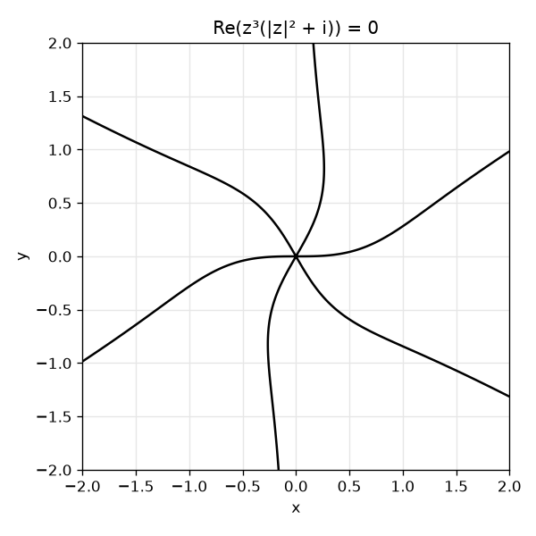

# Sharp symmetry bounds for real algebraic curves

A short note, [PDF](sharp_symmetry_bounds.pdf) and [TeX](sharp_symmetry_bounds.tex),
and a Lean 4 / Mathlib formalization of its results.

## Results

For an infinite real plane curve of degree `d >= 2`, defined by a polynomial
irreducible over the complex numbers and not a circle, the note proves:

- at most `max(d, 2d-4)` rotations, with equality examples in every degree;
- at most `2d` Euclidean symmetries, also sharp in every degree;
- for `d >= 5`, a classification of the curves attaining the rotation bound:
  up to orientation-preserving similarity, `Re(z^(d-2)(|z|^2 + a)) = 0` with
  `|a| = 1` and `a` not real, together with their exact ambient Möbius groups
  and equivalences. The extremal family has no anti-Möbius self-equivalence.

<p align="center"></p>

The quintic `Re(z^3(|z|^2 + i)) = 0`: the case `d = 5`, `a = i` of the
classification, with six rotations, the maximum `2d - 4`.
`uv run figures/quintic.py` draws it, and a view of its complex points in
`figures/quintic-complex.png`.

## Lean formalization

The [Lean port](lean/README.md) checks every clause of Theorem 1, starting from
real Cartesian polynomials and actual Euclidean isometry groups, and every
clause of Theorem 2 for actual ambient transformations: arbitrary Möbius or
anti-Möbius containment forces the stated forms, the full ambient group is
dihedral of order `4m`, the Euclidean group is the `2m` rotations, and the
parameter-equivalence criteria hold. Lemma 4 is checked: irreducibility, the
singular pair and its ordinary `m`-fold points (in standard charts), and genus
`m`, read as the genus of the function field (the dimension of its holomorphic
differentials). Lean reaches the genus through an explicit basis, not through
Riemann–Hurwitz. For Remark 5, the function field of `Re(z^4) = 1` has genus
exactly three and the `m = 2` family's has genus two; a similarity induces an
isomorphism of function fields, so no similarity carries the quartic onto a
curve of that family.

[COVERAGE.md](COVERAGE.md) lists each claim with its Lean declarations and the
reading it is checked at; [STATUS.md](STATUS.md) has the current counts. Only
the axioms `propext`, `Classical.choice` and `Quot.sound` are used, with no
`sorry` and no `native_decide`.

Theorem 1 alone is also published in
[`carlok/sharp-symmetry-bounds-lean`](https://github.com/carlok/sharp-symmetry-bounds-lean)
and registered with Palomar as
[`PALOMAR-2026-09-18-000007`](https://palomar-registry.org/entry?id=PALOMAR-2026-09-18-000007&version=1),
after mechanical verification and an automated editorial review. That is
neither a human review nor a novelty certificate.

The Lean code was written with AI coding agents under the author's direction.

## Literature

The coefficient method is due to Lebmeir–Richter-Gebert and Lebmeir, and is
credited as such; the note proposes the sharp bounds and the equality-case
classification, not that method. An explicit irreducible quintic contradicts
the degree restriction in Lemma 9 of **arXiv:1801.09962v1**; the accepted and
journal versions could not be accessed, so the note makes no claim about them.
The note also replaces the auxiliary `4d` symmetry bound in the Pach–de Zeeuw
manuscript by `2d`, which improves a constant, not their distance exponent.

The proofs were reconstructed, checked against exceptional cases and tested
with exact symbolic arithmetic. The literature search found the underlying
method, but not these bounds with this classification. **That is not a
certificate of novelty**, and no external expert review has taken place. The
versions checked and the remaining checks are in [CHECKS.md](CHECKS.md).

## Reproduce

The root is a Lake project pinned to Lean 4.34.0 and an exact Mathlib revision.
With Elan installed:

```sh
lake exe cache get
lake build
lake env lean -DwarningAsError=true verification/Audit.lean
python3 scripts/check_sources.py
```

To reuse an existing Lake project whose Mathlib is already compiled at the
pinned revision, without downloading anything:

```sh
sh lean/check.sh /path/to/that/project
```

GitHub Actions rebuilds from a clean checkout with the upstream Mathlib cache
and audits the axioms of every declaration in the project namespace. That is
not a Palomar dry run, and the kernel does not check the claim ledger in
COVERAGE.md.

The exact regression checks and the paper:

```sh
uv run verify.py
latexmk -pdf -interaction=nonstopmode -halt-on-error sharp_symmetry_bounds.tex
chktex -q sharp_symmetry_bounds.tex
```

`verify.py` pins SymPy 1.14.0. Its 2,082 checks use exact arithmetic and
include support tests through degree 40; they supplement the proofs and do not
replace them.

## Repository

- `lean/`: the library; `lean/CurveSymmetry.lean` imports all of it.
- `palomar/theorem1/`: development copy of the Theorem 1 entry.
- `verification/`: per-package notes and the axiom audit.
- `figures/`: the figure above and its script.
- [SPRINTS.md](SPRINTS.md): the work plan and its history.

License: Apache-2.0.
